# Capítulo 5: Medición y Caracterización del Problema Público

## 5.1. La Medición y Caracterización del Problema Público

En esta sección se presentan los productos que deben presentarse para demostrar la existencia del problema público. La semana pasada el reto fue la determinación e iteración de la denominación del problema público. Esta semana el reto es medir la magnitud del problema y caracterizar sus dimensiones.

Antes de proceder con la medición es necesario definir los conceptos más importantes que involucran al problema público. Por ejemplo, tienes el problema público "Alta Tasa de denuncias por el delito contra el patrimonio por cada mil habitantes en la ciudad de Trujillo", en ese sentido hay que recurrir a ramas como la criminología, derecho, sociología criminal o antropología criminal para definir qué se entiende por "delito", "delitos contra el patrimonio" y "denuncias". Es un asunto que deben realizar antes de medir el problema público.

Es fundamental que los grupos levanten información trazable, sistemática y confiable para el desarrollo de la medición y la caracterización.

---

## 5.2. La Medición del Problema Público

### ¿Qué es un Indicador?

Un indicador es una medida observable que permite describir características, comportamientos o fenómenos a través de su comparación con períodos anteriores o con metas o compromisos (MEF).

Según el DANE de Colombia, un indicador es una expresión observable que permite describir características, comportamientos o fenómenos de la realidad a través de la evolución de una variable o el establecimiento de una relación entre variables, la que comparada con períodos anteriores, productos similares o una meta o compromiso, permite evaluar el desempeño y su evolución en el tiempo.

Por lo general, los indicadores son fáciles de recopilar, altamente relacionados con otros datos y de los cuales se pueden sacar rápidamente conclusiones útiles y fidedignas.

### Características Básicas de un Indicador

Un indicador debe cumplir con tres características fundamentales:

1. **Simplificación:** La realidad en la que se actúa es multidimensional. Un indicador puede considerar alguna de tales dimensiones, pero no puede abarcarlas todas.

2. **Medición:** Permite comparar la situación actual de una dimensión de estudio en el tiempo o respecto a patrones establecidos.

3. **Comunicación:** Todo indicador debe transmitir información acerca de un tema en particular para la toma de decisiones, en uestro caso del problema público.

__[DANE - Guía de construcción e interpretación de indicadores](https://www.dane.gov.co/files/planificacion/fortalecimiento/cuadernillo/Guia_construccion_interpretacion_indicadores.pdf)__

### El Reto: Seleccionar el Indicador Correcto

El reto se encuentra en identificar el indicador o los indicadores que mejor representan al problema público que hemos seleccionado. Potencialmente pueden encontrar tres o cuatro opciones. Es necesario discutir en grupo cuál de ellos mejor representa el problema.

### Ejemplos de Indicadores por Sector

**Seguridad Ciudadana:**
* "Tasa de denuncias por el delito contra el patrimonio por cada mil habitantes"
* "Tasa de homicidios por cada mil habitantes"

**Educación Pública:**
* Niños del cuarto grado de educación primaria con nivel satisfactorio en matemática y lectura, según sexo, sector y área de residencia (2016-2023)

**Salud:**
* Entre el 2002 y el 2022, la mortalidad infantil en Perú pasó de 16 a 17 por 1000 nacidos vivos, lo cual implicó un aumento de 6.3%

### Métricas Complementarias

Los indicadores del problema público pueden ir acompañados por una serie de métricas que sirvan para comprenderlo, tales como:

* Número de beneficiarios o ciudadanos involucrados
* Presupuesto involucrado
* Número de trabajadores o funcionarios estatales involucrados

Estos datos cuantitativos deben ser recabados en fuentes de información confiables y verificables.

### Visualización de Datos

Se recomienda acompañar los indicadores con gráficos o tablas de data visualization. Aquí se presentan ejemplos:

**Ejemplo 1: Tendencia de Delitos Contra el Patrimonio en Perú (2018-2026)**
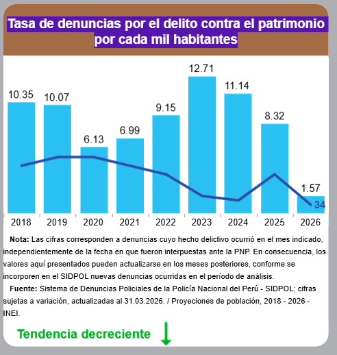

**Ejemplo 2: Visualización Comparativa**
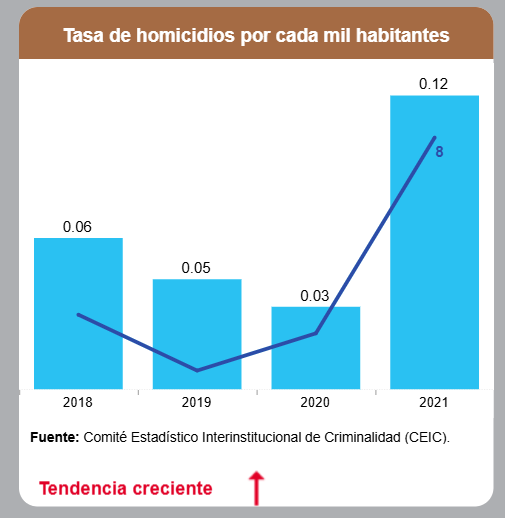

**Ejemplo 3: Desempeño en Educación por Género, Sector y Área (2016-2023)**
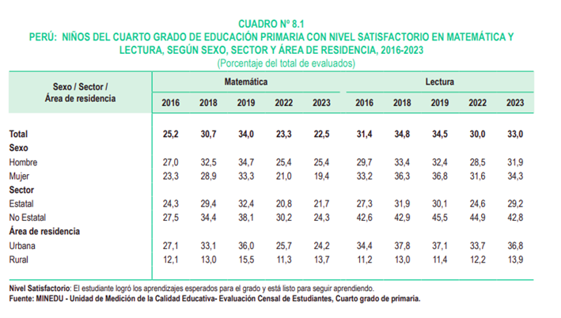

**Ejemplo 4: Mortalidad Infantil en Perú (2002-2022)**
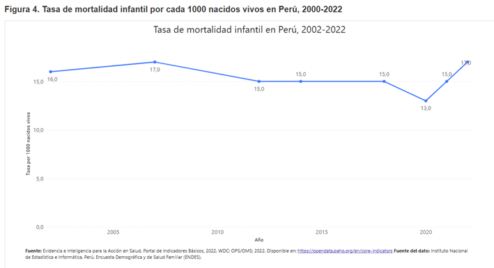

### Recursos Recomendados

Para explorar más tipos de visualización de datos:

* __[ThoughtSpot - Tipos de gráficos y visualizaciones](https://www.thoughtspot.com/data-trends/data-visualization/types-of-charts-graphs)__
* __[Datylon - Ejemplos de tipos de gráficos](https://www.datylon.com/blog/types-of-charts-graphs-examples-data-visualization)__

---

## 5.3. Caracterización del Problema Público

Los problemas públicos no solo deben ser caracterizados a través de sus indicadores. Deben caracterizarse sus diferentes dimensiones, como por ejemplo:

* Lo que piensan y comentan los principales afectados (ciudadanía)
* Lo que opinan los involucrados directos (burócratas o funcionarios)
* El proceso involucrado en el servicio o programa estatal que se está analizando

En las siguientes secciones presentamos cinco artefactos de caracterización de los problemas públicos. La idea es que analices cuál de ellos te sirve. Se solicita que utilices al menos tres de ellos en la presentación de tu trabajo parcial.

1. **Storyworld** - Para capturar las voces y narrativas de los actores
2. **Redes de Actores** - Para comprender las relaciones e influencias
3. **Mapeo de Procesos** - Para visualizar cómo funcionan los sistemas actuales
4. **Journey Maps** - Para entender la experiencia del usuario
5. **Mapas Parlantes** - Para contextualizar territorialmente el problema

> **Nota Importante:** La construcción de estos artefactos implica levantar datos e información en fuentes confiables. Esto también podría realizarse con apoyo del toolbox adjunto.

---

## Herramienta 1: Voces de los Actores Involucrados (Storyworld)

### ¿Qué es Storyworld?

El Storyworld proporciona una forma estructurada para recoger datos y apreciaciones de los actores involucrados en el problema (ciudadanos, funcionarios, stakeholders, etc.) y darle sentido a la información recopilada.

Permite resaltar las ideas más relevantes de la investigación y ordenar la documentación de manera narrativa y visual.

### ¿Cuándo Usar Esta Herramienta?

Es ideal para recolectar apreciaciones. Puedes utilizarla al momento de empatizar con el público objetivo a través de:

* Entrevistas
* Focus groups
* Observaciones
* Métodos presenciales o virtuales

### La Importancia de la Narración

Describir la vida cotidiana de las personas para quienes se quiere trabajar una solución es una tarea compleja. Por esta razón, la narración es una gran manera de construir una imagen detallada que facilita contar historias que resulten más fácil de entender.

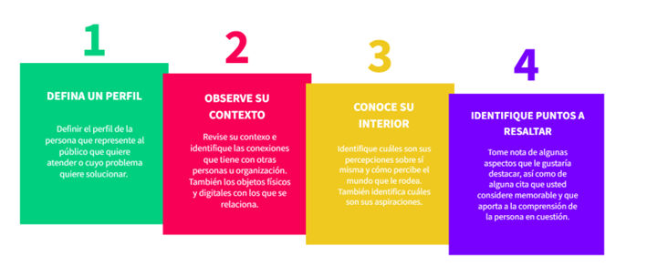

### Pasos Operativos

1. Identifique las personas que están involucrados con el problema público
2. Caracterice estas personas y los perfiles que tienen, considerando cualquier elemento que luzca relevante frente al problema público
3. Levante información sobre sus percepciones y conocimiento del problema público:
   * Información que usted recogió directamente
   * Información que un tercero haya recogido
   * Puede realizarse de forma presencial o virtual
4. Seleccione puntos resaltantes de lo comentado por los actores involucrados y plantee citas directas
5. Presente la información de la forma más gráfica posible

### Ejemplos Visuales

Se presenta las historias de adultos mayores que han denunciado a la policia que familiares suyos han ejercido violencia contra ellos.

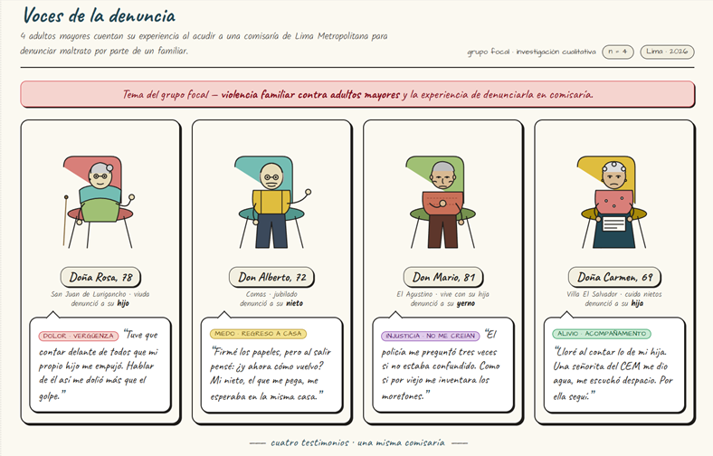

---

## Herramienta 2: Redes de los Actores Involucrados

### Concepto Fundamental

Los actores involucrados en un problema público interactúan y, a través de estas interacciones, forman redes que pueden llegar a ser bastante complejas.

Existen varias formas de representar estas redes:

* Algunas más de tipo cualitativo
* Otras más formales y cuantitativas

### Enfoque Cualitativo: Mapa de Actores

#### ¿Qué es un Mapa de Actores?

El Mapa de Actores representará visualmente las distintas personas que están relacionados con el problema y las relaciones que existen entre éstos.

#### Categorización por Nivel de Influencia

De acuerdo a su nivel de influencia con el problema, puedes categorizarlo en niveles:

* **Rol Núcleo:** Están muy relacionados con el problema
* **Rol Directo:** Están relacionados
* **Rol Indirecto:** Tienen una relación más lejana

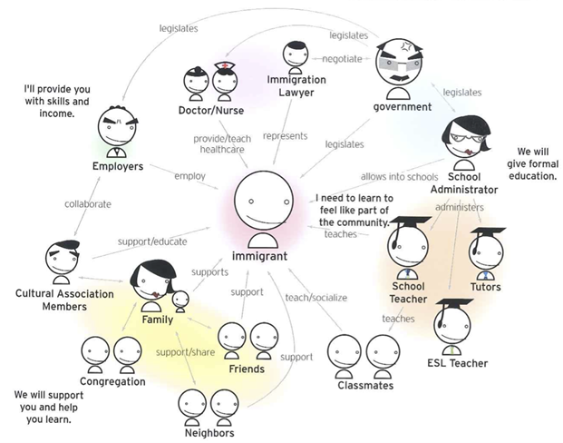

#### Pasos para Diseñar un Mapa Cualitativo de Actores

1. Partir del problema y cuáles son sus características
2. Identificar a todos los actores que están relacionados con el problema público:
   * Necesita buscar información sistemáticamente
   * Utilice el toolbox adjunto si es necesario
3. Revisar que ningún actor falte recurriendo a consultas adicionales
4. Establecer las relaciones:
   * Defina qué tipo de relación pretende identificar
   * En función de la información disponible, dibuje las relaciones

#### Ejemplo Práctico

A continuación se presenta un mapeo de redes de actores involucrados en un problema público relacionado a personas adultas mayores que se acercan a una comisaría de Lima a denunciar un maltrato físico de un familiar suyo en casa.

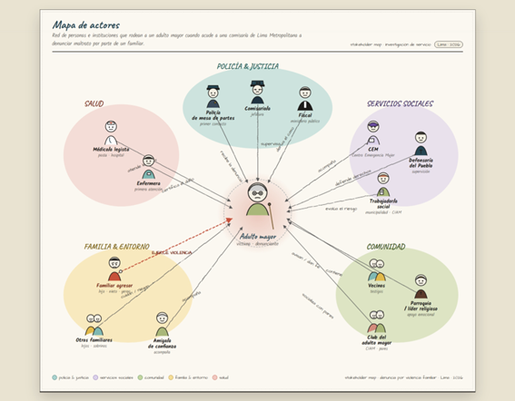

### Enfoque Cuantitativo: Análisis Formal de Redes

El análisis cuantitativo implica aprender una serie de conceptos y metodología más avanzada.

Por ahora no se recomienda su uso, pero si está interesado en aprender, aquí hay un recurso introductorio:

__[Análisis de Redes - Ciencia de Datos](https://bookdown.org/keilor_rojas/CienciaDatos/an%C3%A1lisis-de-redes.html)__

---

## Herramienta 3: Mapeo de Procesos

### ¿Qué es un Mapa de Procesos?

Un mapa de procesos es una representación visual que describe cada paso de una tarea o proyecto. Ofrece una visión general completa del flujo de trabajo, desde el principio hasta el final.

### Ventajas del Mapeo de Procesos

Los diagramas de procesos utilizan símbolos, formas y flechas para dividir procesos complejos en segmentos comprensibles. Esto ayuda a los equipos a:

* Identificar ineficiencias
* Mejorar la comunicación
* Resaltar oportunidades de mejora

### Pasos para Construir un Mapa AS IS

**Paso 1: Identifique el objetivo de su flujo de trabajo**
* Definir el proceso a graficar
* Determinar qué nivel de detalle incluir
* Identificar de quién necesita la información para completar su mapa de procesos

**Paso 2: Lluvia de ideas sobre los pasos del proceso**
* Invite a las partes interesadas clave a colaborar
* Identifique los pasos del proceso
* Determine los recursos esenciales (personal y tecnología)
* Localice los puntos de decisión
* Defina los entregables
* Identifique las etapas y subetapas del proceso tal como funciona en la actualidad

**Paso 3: Diseñe su mapa de procesos**
* Decida qué tipo de mapa se adapta mejor a sus necesidades
* Utilice formas geométricas (rectángulos, rombos, óvalos)
* Agregue símbolos para representar las diferentes actividades o fases del flujo de trabajo

### Recursos

Para más información sobre 6 tipos diferentes de mapeo de procesos, consulte: __[Figma - Qué es el mapeo de procesos](https://www.figma.com/resource-library/what-is-process-mapping/)__

### Ejemplo: Denuncia en Comisaría

A continuación se presenta un mapeo de procesos relacionado a un proceso de denuncia en una comisaría de Lima por parte de una persona adulta mayor.

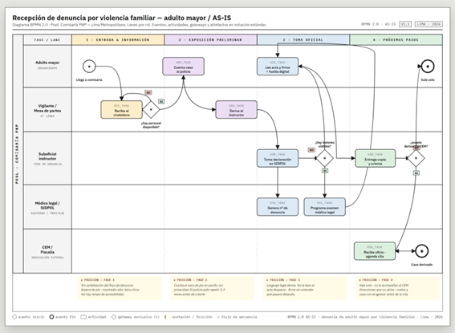

---

## Herramienta 4: Journey Map (Mapa del Recorrido del Usuario)

### ¿Qué es un User Journey Map?

Un user journey map (o mapa del recorrido del usuario) ofrece una representación visual de la experiencia del cliente. En nuestro caso, se refiere a la experiencia del ciudadano o del funcionario, dependiendo de quién sea el actor central desde el que pretendes modelar el viaje.

Esta visualización puede:

* Abarcar toda la relación de un cliente con una marca o servicio
* Centrarse en una experiencia concreta al interactuar con un servicio, aplicación o sitio web

Los user journey maps son una herramienta útil para comprender las necesidades y los puntos débiles de los servicios utilizados por los usuarios.

### Pasos Básicos para Crear un User Journey Map

**Paso 1: Define el Alcance**

La creación de un user journey map útil comienza con la definición de tus objetivos:

* ¿Deseas describir el viaje del usuario en todo el servicio o parte de este?
* Por ejemplo, ¿mapear todo el servicio de denuncia dentro de una comisaría o solo parte del proceso?

**Paso 2: Crea Personajes de Usuario**

Normalmente, necesitarás un mapa diferente para cada segmento de usuarios. No todos tus usuarios tendrán las mismas necesidades.

Considera segmentos como:

* Jóvenes
* Adultos mayores
* Mujeres
* Otros grupos vulnerables

La idea es reconocer cómo estos diferentes usuarios experimentan el servicio. Esto suele comenzar con la investigación de usuarios a través de:

* Entrevistas
* Grupos de discusión
* Encuestas
* Retroalimentación previa

**Paso 3: Define Objetivos, Expectativas y Puntos Débiles**

Una vez que tengas una idea más clara de quién es tu usuario objetivo, dedica algún tiempo a pensar en:

* **Objetivos:** ¿Qué quiere lograr el usuario?
* **Expectativas:** ¿Qué expectativas podrían tener al iniciar el viaje?
* **Puntos débiles:** ¿A qué problemas podrían enfrentarse? ¿Qué aspectos del servicio podrían causarles frustración?

**Paso 4: Enumera los Puntos de Contacto y Canales**

El término "punto de contacto" se refiere a un punto de interacción entre un usuario y el servicio. Estos puntos pueden producirse a través de muchos canales diferentes:

* Espacios físicos
* Sitios web
* Plataformas de redes sociales
* Aplicaciones
* Anuncios
* Comunicaciones cara a cara

Crea un inventario de todos los puntos de contacto y canales implicados en el escenario que has definido.

**Paso 5: Traza el Recorrido**

Ya has recopilado los datos que necesitas, así que ahora es el momento de visualizar esta información. Aquí puedes ser creativo. Tu mapa puede ser:

* Tan sencillo como una línea de tiempo
* Tan complejo como un guión gráfico que muestre visualmente lo que ocurre en cada fase
* Desde notas adhesivas en una pizarra hasta una hoja de cálculo Excel o un programa especializado

**Paso 6: Valida y Perfecciona el Mapa**

La solidez de un mapa del recorrido del usuario depende de su veracidad. Valídalo:

* Recorriéndolo tú mismo
* Realizando pruebas de usabilidad
* Analizando datos
* Recopilando opiniones de los usuarios para verificar que refleja la realidad

### Ejemplo: Don Alberto en Comisaría

A continuación se muestra un ejemplo completo que ilustra el journey map detallando los pasos emocionales y procedimentales que Don Alberto (un adulto mayor) experimenta cuando reporta abuso doméstico en la comisaría local de Lima.

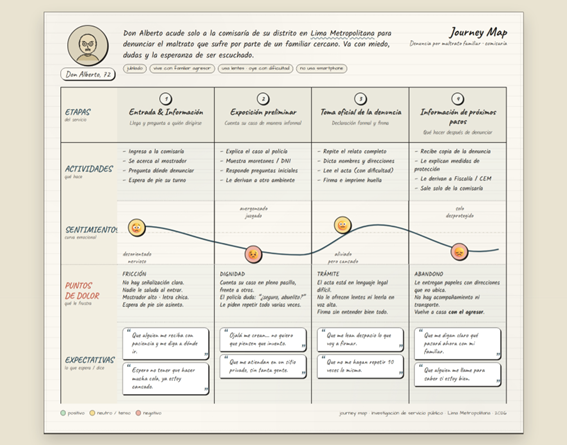

### Referencia Completa

Para una guía más detallada, consulta: __[Coursera - Creando User Journey Maps](https://www.coursera.org/mx/articles/creating-user-journey-maps-a-guide)__

Se recomienda ingresar y leer la entrada completa. Es muy informativa y te servirá para construir tus propios journey maps.

---

## Herramienta 5: Mapas Parlantes y Rutas

### Concepto Fundamental

Los mapas y las rutas sirven para contextualizar los problemas públicos, cómo se suceden y dinamizan en el territorio.

Existen diferentes formas de abordar los mapas y rutas dentro de la ciencia de las políticas públicas:

* Algunas de formas más cualitativas
* Otras de formas cuantitativas y espaciales

### ¿Qué son los Mapas Parlantes?

Los Mapas Parlantes son una versión de construcción cualitativa de estos mapas y las rutas que pueden incluir.

**Objetivo:** Conocer de forma gráfica el proceso vivido de los actores involucrados, identificando los factores de riesgo y de protección.

### Características Principales

* Buscan representar el proceso vivido de los actores involucrados
* Identifican factores de riesgo
* Identifican factores de protección
* Incluyen hitos y puntos de interés (oficinas públicas, avenidas, calles, iglesias, espacios sociales, accidentes geográficos)

### Proceso de Construcción

La construcción de estos mapas parlantes usualmente implica:

1. Levantar información directamente de los actores involucrados en el problema
2. Reconstruir con ellos los mapas y las rutas recorridas
3. Ubicar geográficamente los principales hitos y puntos de interés

### Utilidad para el Análisis

Este tipo de mapa sirve para que el analista de políticas públicas comprenda:

* **Territorialidad:** Cómo se distribuye espacialmente el problema
* **Movilidad:** Cómo se mueven los actores involucrados en el territorio
* **Contexto territorial:** El entorno geográfico en el que se desarrolla el problema público

### Ejemplo Visual

Aquí se presenta un mapa parlante como ejemplo:

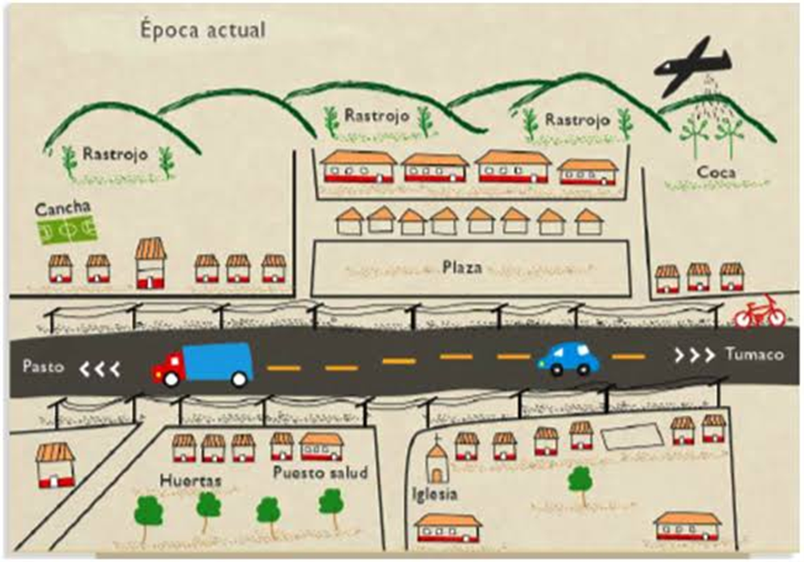

### Caso de Estudio: Denuncia de un Adulto Mayor

A continuación se presenta un mapa parlante sobre el proceso de denuncia de un adulto mayor desde que salió de su hogar hasta que fue a la comisaría.

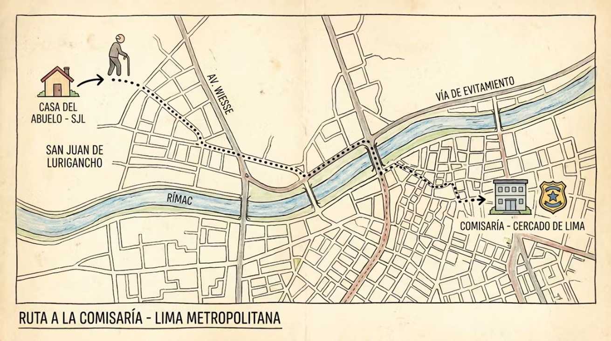

### Enfoques Cuantitativos y Espaciales

Existen técnicas cuantitativas y espaciales que pueden ser utilizadas si usted considera que tiene las habilidades para su aplicación.

Aquí encontrará una introducción a la estadística espacial: __[SEIO - Una introducción a la estadística espacial](https://www.seio.es/beio/una-introduccion-a-la-estadistica-espacial/)__

---

## Conclusión

Estos cinco artefactos te proporcionan un conjunto completo de herramientas para caracterizar los problemas públicos desde múltiples perspectivas:

1. **Storyworld** - Para capturar las voces y narrativas de los actores
2. **Redes de Actores** - Para comprender las relaciones e influencias
3. **Mapeo de Procesos** - Para visualizar cómo funcionan los sistemas actuales
4. **Journey Maps** - Para entender la experiencia del usuario
5. **Mapas Parlantes** - Para contextualizar territorialmente el problema

La combinación de al menos tres de estas herramientas te permitirá desarrollar un análisis profundo y multidimensional del problema público que estés estudiando.

**Recuerda:** La calidad de tu análisis depende de la calidad de la información que recopiles. Asegúrate de usar fuentes confiables y verificables en todo momento.
