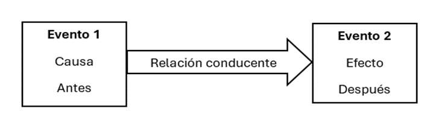
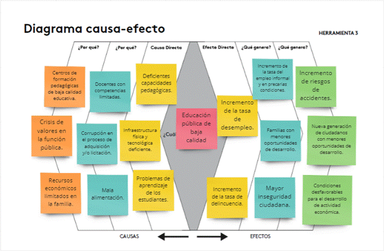
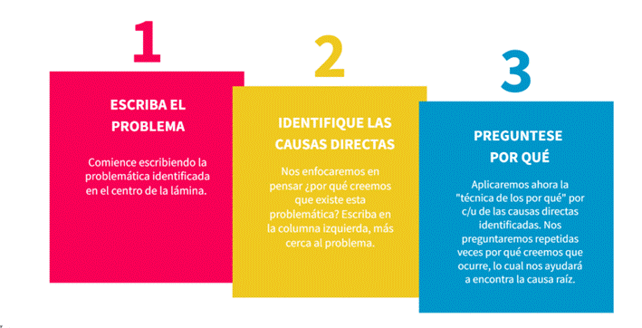
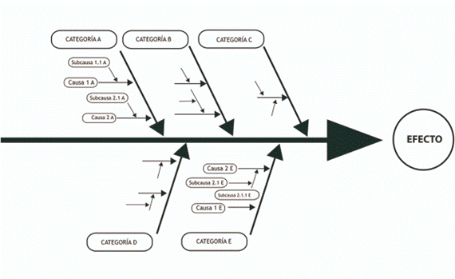
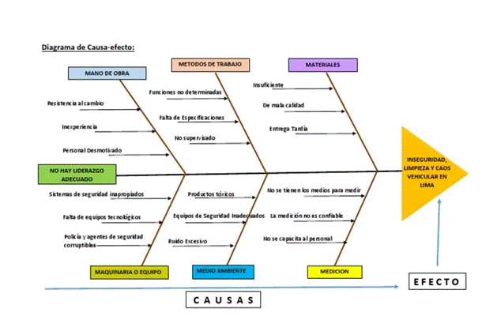
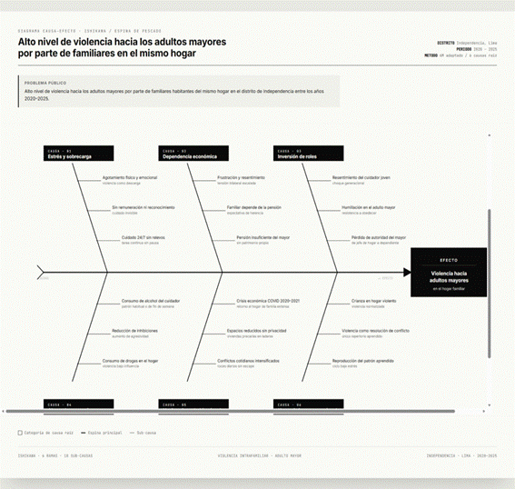

# Clase 6: Identificación de Causas del Problema Público

## Introducción

Identificar las causas de los problemas públicos es un paso fundamental en el diseño de innovaciones efectivas. Las causas explican por qué existen los problemas y orientan dónde intervenir. Sin embargo, esta identificación debe sustentarse en **evidencia rigurosa**, no en opiniones, intuiciones o creencias.

Según Helen Pearson, la medicina basada en evidencia ganó preeminencia en los años noventa y posteriormente se extendió a otros campos del conocimiento. Hoy, en políticas públicas e innovación pública, este enfoque es imprescindible.

**Referencia:** https://princetonuniversitypress.substack.com/p/how-should-evidence-not-opinions

La tarea es actuar como un detective: buscar y descubrir las verdaderas causas del problema público, no las obvias o las que primero vienen a la mente.

---

## 6.1. Conceptos Básicos

### ¿Qué es Causalidad?

La causalidad se refiere a la relación entre eventos donde uno —la **causa**— produce u origina otro —el **efecto**. Más específicamente, existe causalidad cuando un evento desencadena otro.

Para que identifiquemos causalidad verdadera, deben cumplirse tres condiciones simultáneamente:

1. **Existencia de los eventos**: Ambos eventos (causa y efecto) deben existir y ser comprobables.
2. **Relación conducente**: Debe haber una conexión especial de causa-efecto: la causa crea o genera el efecto, no solo lo acompaña.
3. **Anterioridad temporal**: La causa siempre debe ocurrir antes que el efecto.

**Referencia:** https://www.ebsco.com/research-starters/religion-and-philosophy/causality

### Causas Necesarias y Causas Suficientes

Una distinción crítica al identificar causas es entender si son **necesarias**, **suficientes** o ambas.

**Causa Necesaria:** Es aquella sin la cual el problema no ocurre. Sin embargo, su presencia no garantiza el efecto. 

*Ejemplo:* Disparar un arma es necesario para que una bala alcance un blanco, pero disparar no garantiza que lo haga (podría errar).

**Referencia:** https://www.ebsco.com/research-starters/religion-and-philosophy/causality

**Causa Suficiente:** Es aquella que por sí sola genera el efecto. Basta que ocurra para que el problema exista.

*Ejemplo:* Si una bala salió disparada del arma, entonces se apretó el gatillo.

**En problemas públicos**, frecuentemente encontramos **causas conjuntivas**: múltiples causas que juntas producen el efecto, pero ninguna por separado es suficiente.

### Confusiones Frecuentes al Identificar Causas

#### a) Confundir causas con condiciones

Las **condiciones** facilitan o aceleran un problema, pero no lo causan directamente. Tienen un rol pasivo.

*Ejemplo:* En demoras de atención pediátrica en un hospital, la causa directa puede ser falta de pediatras. Una condición que la agrava es el tráfico de Lima, que retrasa la llegada de médicos, pero no es la causa fundamental.

#### b) Confundir causas con correlaciones

Dos eventos pueden ocurrir simultáneamente o estar relacionados sin relación causal.

*Ejemplo:* Las vacunas infantiles se administran justo antes de cuando se diagnostica autismo, generando una falsa correlación. Numerosos estudios refutan cualquier relación causal, pero la coincidencia temporal persiste en la creencia pública.

#### c) Advertencia sobre respuestas obvias

En mi experiencia como docente, los estudiantes frecuentemente identifican como causas: *"Falta de presupuesto"*, *"Falta de capacitación"* o *"Falta de personal"*. Si bien estas pueden ser causas en algunos casos, **no son la explicación universal** para todos los problemas públicos en Perú. Es necesario verificar empíricamente qué causa realmente el problema que analizas.

---

## 6.2. Trabajo Previo para Identificar Causas

Antes de llegar a conclusiones causales, se recomienda realizar tres actividades preparatorias:

### a) Lluvia de ideas basada en experiencia

Reúnete con el equipo para identificar 5-6 potenciales causas a partir de vuestra experiencia en el campo y de investigación preliminar. Usa postits para responder:
- ¿Cuáles son las potenciales causas?
- ¿Cómo se relacionan con el problema público?

### b) Revisar literatura científica

Consulta revistas científicas y textos especializados de diferentes disciplinas. Recuerda la importancia de una perspectiva **STEAM** para comprender problemas multidimensionales.

### c) Revisar documentos de instituciones públicas y ONGs

Tanto el Estado como organizaciones de la sociedad civil pueden haber identificado causas. Aunque el Estado peruano frecuentemente identifica mal las causas, algunos organismos han hecho esfuerzos sólidos. Revisa sus reportes e informes.

**Resultado de estas actividades:** Tendrás un conjunto de causas preliminares que deberán ser validadas como eventos reales y conectadas causalmente al problema.

---

## 6.3. Estrategias para Identificar y Validar Causas

Existen al menos tres estrategias principales, cuya selección depende de:
- Número de casos disponibles
- Habilidades del equipo
- Naturaleza del problema

### a) Estrategias Visuales

#### Diagrama de Causa-Efecto

Esta herramienta (adaptación del Laboratorio de Gobierno de Chile) simplifica el análisis visual de causas. A diferencia del Diagrama de Ishikawa, incluye preguntas guía:
- ¿Cuál es el problema?
- ¿Cuál es el efecto directo?
- ¿Cuál es la causa directa?

**Paso a paso:**

1. **Especificar el problema** a analizar (debe estar delimitado)
2. **Buscar todas las causas probables** sin discriminar inicialmente
3. **Agrupar por afinidad** y representar en el diagrama
4. **Revisar y agregar** causas faltantes; luego votar para priorizar (5 puntos a la más importante, 3 a la segunda, 1 a la tercera)
5. **Seleccionar causas** a investigar considerando importancia y factibilidad
6. **Preparar plan de acción** para cada causa

#### Diagrama de Ishikawa

Útil para obtener una perspectiva sistémica del problema. Evita buscar soluciones antes de cuestionarse sobre las verdaderas causas.

### b) Estrategias Cualitativas

**Para 1 caso:** Usa **Estudio de caso con process tracing**

Este método reconstruye la cadena causal eslabón a eslabón, conectando cada causa con el problema público a través de información cualitativa.

*Según Bril-Mascarenhas, Maillet y Mayaux (2017):* "El process tracing arriba a inferencias causales sólidas, produciendo una narrativa que articula hipótesis y mecanismos causales para explicar resultados de interés."

**Referencia:** https://dialnet.unirioja.es/descarga/articulo/9649577.pdf

**Ejemplo:** Tienes como problema público el alto nivel de residuos sólidos de construcción (desmonte) desperdigados en avenidas principales del distrito de Comas entre 2024-2025. Identificas cuatro causas necesarias:

1. Falta de rellenos sanitarios ideales para este tipo de residuos por parte de la municipalidad
2. Ausencia de política o estrategia de reciclaje de este material
3. Reducido presupuesto y planificación de propietarios de viviendas en refacción (quienes generan los residuos)
4. Existencia de una red de "recicladores informales" que cargan y depositan el material

Con process tracing, reconstruyes cómo cada una de estas causas se conecta con el problema: ¿quién genera el desmonte?, ¿por qué no va a rellenos legales?, ¿cómo intervienen los recicladores informales?, ¿qué rol juega la municipalidad?

**Para más de 2 casos (hasta 10):** Usa **Método comparado**

- **Sistema de máxima diferencia:** Compara territorios distintos con el mismo problema. ¿Por qué ocurre en ambos?
- **Sistema de máxima similitud:** Compara territorios similares donde el problema ocurre en uno pero no en el otro. ¿Qué diferencia explica la brecha?

**Referencia:** https://www.redalyc.org/pdf/7374/737481065007.pdf

### c) Estrategias con Regresiones

Se aplican cuando tienes **muchos casos** (suficiente variabilidad). Las regresiones identifican correlaciones, pero con cuidados pueden proporcionar evidencia de causalidad.

**Referencia general:** https://sustainabilitymethods.org/index.php/Regression_Analysis

**Requisitos para interpretar una regresión como causal:**

1. **X debe ser exógena (independiente):** X no debe estar influenciada por Y ni por otras causas conjuntas
2. **Incluir todas las variables confusoras:** Un confusor es todo factor que afecta tanto a X como a Y, creando correlación espuria
3. **Teoría con mecanismo claro:** Los números significativos no bastan; debes explicar lógicamente por qué X causa Y

**Para más herramientas de investigación:** https://www.betterevaluation.org/tools-resources

---

## 6.4. Ejemplo de Aplicación Completo

### Paso 1: Definir el Problema

**Problema público:** "Alto nivel de violencia hacia adultos mayores por parte de familiares habitantes del mismo hogar en el distrito de Independencia, Lima, entre 2020-2025"

### Paso 2: Medir y Contextualizar

- Cuantificar la magnitud (números, tasas)
- Identificar población: tamaño, condiciones socioeconómicas
- Mapear actores involucrados (familia, servicios de salud, municipalidad, policía)

### Paso 3: Búsqueda Preliminar de Causas

Combina tu experiencia, literatura académica y documentos del Estado/ONGs.

### Paso 4: Validar Causas con Información Empírica

Para este caso (un distrito específico), usa **case study con process tracing** para confirmar y reconstruir las cadenas causales.

**Causas identificadas:**

1. **Estrés y sobrecarga del cuidador familiar**
   - El familiar cuida 24/7 sin apoyo ni remuneración
   - El estrés crónico se descarga en violencia
   - Mecanismo: cuidado intenso sin apoyo → violencia

2. **Dependencia económica mutua con tensión**
   - El adulto mayor depende de pensión insuficiente
   - El familiar también depende de esa pensión o herencia
   - La dependencia bilateral genera resentimiento que escala a violencia

3. **Cambio en dinámicas de poder familiar**
   - Históricamente, el adulto mayor tenía autoridad
   - Ahora es dependiente, invirtiendo roles
   - Esta reversión genera humillación en el mayor y resentimiento en el cuidador joven

4. **Abuso de alcohol o drogas del cuidador**
   - Las sustancias bajan inhibiciones y aumentan agresividad
   - En contexto de estrés familiar, el cuidador bajo influencia es más propenso a la violencia

5. **Hacinamiento derivado de crisis económica**
   - Especialmente durante 2020-2021, familias convivieron en espacios muy pequeños
   - El hacinamiento intensifica tensiones y reduce privacidad
   - Los conflictos cotidianos se resuelven con violencia

6. **Herencia intergeneracional de patrones de violencia**
   - El cuidador creció en hogares donde la violencia era forma de resolver conflictos
   - Reproduce ese patrón cuando enfrenta estrés con el adulto mayor

### Paso 5: Graficar las Causas

Representa las causas y sus relaciones usando diagrama de causa-efecto o Ishikawa.

---

## Reflexión Final

El trabajo de identificación causal es riguroso y exigente. Requiere combinar evidencia empírica, análisis lógico y método sistemático. La recompensa es comprender verdaderamente **dónde intervenir** para resolver el problema público, no solo tratar síntomas.

Recuerda: una innovación pública bien orientada ataca las causas, no solo las consecuencias visibles.
