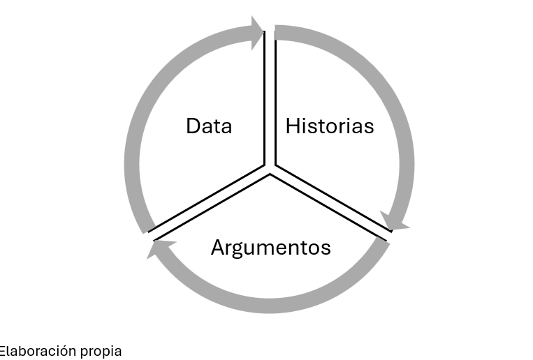
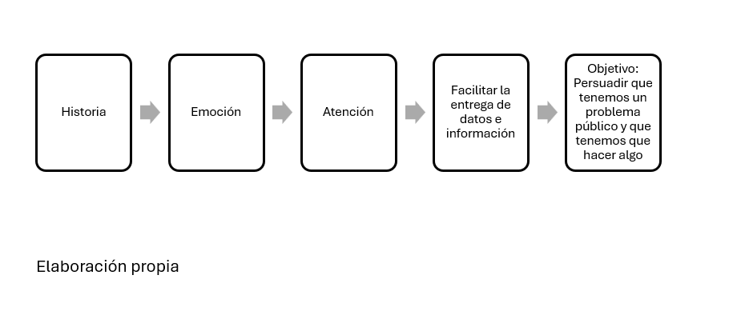
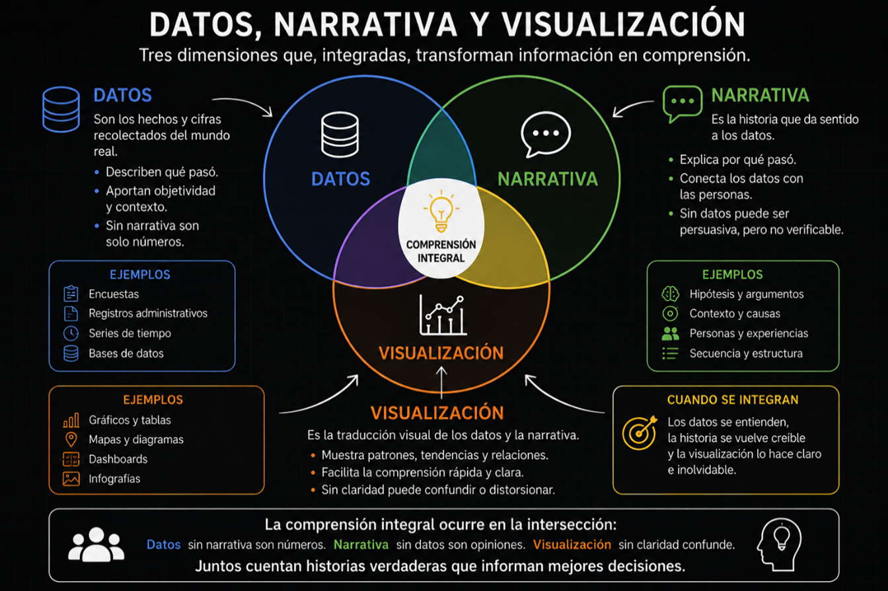
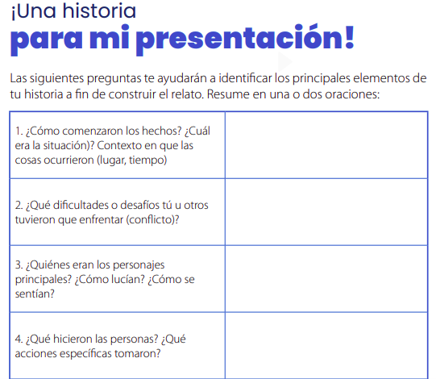

# Clase 7: El Data Storytelling, el arte de contar historias eficaces con datos: en este caso del problema público

El data storytelling es una técnica comunicativa que nos servirá para captar la atención de un público al que tenemos la intención de transmitir el problema público y la innovación que se ha construido. En esta sección nos enfocaremos en el data storytelling del problema público. 

## ¿Qué es el data storytelling?

Como adelantábamos el data storytelling es una técnica comunicativa que sirve para crear historias atrapantes que nos permitan hacer llegar un mensaje final que deje un aprendizaje o concepto, en nuestro caso las características y las implicancias de un problema público. El objetivo es entregarle la información y la data a un público, pero primero captando su atención a través de una historia. 

A diferencia de otros tipos, el data storytelling tiene por objetivo no solo presentar información en prosa sino presentar datos los que muchas veces son bastante complejos y llenos de formalización. Entendemos que presentar conclusiones sin data es insuficiente en un contexto de políticas públicas basadas en evidencia. Pero también, se entiende que presentar datos por si solos no es memorable y no invita a la acción. En ese sentido, lo mejor es combinar: historias, argumentos y data. 

El data storytelling en particular tiene el desafío de captar la atención para hacer llegar a las personas conclusiones basados en datos con la intención de convencerlos que debe realizarse alguna acción, pero a través de una historia o alentados por una de ellas. 

Esta técnica se ocupa de la construcción de una narración detallada, basada en personajes, de las luchas de alguno de ellos por superar obstáculos y alcanzar una meta importante" (Haven, 2007, como se citó en Dietz & Silverman, 2014). El data storytelling comienza primero planteando los argumentos y consiguiendo y perfilando de la mejor manera la data; a partir de estos elementos se vislumbra un mensaje que hay que transmitir. Una vez logrados los argumentos y los datos, es necesario construir la historia. Una historia cautivante basado en un personaje que enfrenta un gran desafío, esto hará que el público tome atención a tu mensaje final. 

En lugar de pedirle a alguien que interprete números en bruto o gráficos densos por su cuenta, las historias presentan o introducen cantidades de información manejables de una manera clara y atractiva que realiza gran parte del trabajo analítico pesado. Esto hace que los conocimientos sean más accesibles para el público no técnico y respalda una toma de decisiones más sólida y segura. 

## ¿Cuál debería ser el efecto en el público?

El mecanismo que desencadena la historia es interesante. Las historias que usualmente se comentan aquí tratan sobre personajes que enfrentan desafíos que por momentos parecen insuperables. Eso conecta con el público porque ha visto que él mismo o personas conocidas suyas han sufrido el mismo problema. Aquello permite que el público sienta emociones. El público debería responde a una buena historia sintiendo amenaza, pérdida, frustración, incertidumbre, culpa, miedo o impotencia. 

Eso inmediatamente causa atención porque quiere saber de la historia de ese personaje. Una vez que se ha enganchado con la historia, puedes fácilmente entregarle argumentos, información y datos. Finalmente, en ese contexto puedes persuadirle de que existe un problema público, es decir que la situación no solo afecta a tu personaje, sino que es una situación extendida y preocupante, y que incluso lo has demostrado midiéndolo.

## La neurociencia de las historias

Cuando alguien escucha una historia, se activan múltiples partes del cerebro, entre ellas:

- **El área de Wernicke** (región temporal superior izquierda del cerebro): Procesa y entiende el lenguaje hablado y escrito. No solo decodifica palabras, sino que construye significado de las frases. Las historias activan esta área de forma más profunda porque hay más contexto, matices y relaciones entre palabras. En términos coloquiales esta parte del cerebro permite que en nuestro cerebro se proyecte como una película, mientras vamos escuchando la historia.

- **La amígdala** (centro del cerebro, en el sistema límbico): Procesa emociones (miedo, alegría, tristeza, sorpresa, confianza) y asigna "importancia emocional" a los eventos (la historia planteada). Lo que la amígdala marca como importante se retiene mejor.

- **Las neuronas espejo** (Corteza premotora y parietal del cerebro): Permiten que cuando vemos o escuchamos a alguien hacer o sentir algo (el personaje de nuestra historia), nuestro cerebro literalmente simula esa acción o emoción. Es como si viviéramos la historia internamente.

- **El Hipocampo** (sistema límbico): Es como el "indexador" del cerebro. Cuando múltiples sistemas están activados simultáneamente, el hipocampo marca esa experiencia como importante y la consolida en memoria a largo plazo. 

## ¿Qué reúne el data storytelling en la parte analítica?

El datastorytelling en su parte analítica reúne datos, narrativa y visualización. Los datos son los hechos y cifras recolectados. La narrativa es la historia que da sentido a esos datos. Finalmente, la visualización es la traducción visual de los datos y de la narrativa en gráficos. 

En ese marco no nos olvidemos que los datos deben ir acompañados de visualizaciones o gráficos que capten la atención. Se puede tener una excelente historia, excelentes argumentos, excelentes datos, pero visualizaciones o gráficos (tablas o figuras) de esos datos que hacen confundir al público. 

Sin lugar a dudas, una historia es muy buena como herramienta para captar la atención, pero los datos presentados y su visualización deben estar alineados a esta historia, no generar confusión ni contradicción. 

## ¿Cómo construir la historia?

### Tener bien claro el mensaje de lo que se quiera transmitir

Es necesario tener desde el inicio claro el mensaje, y en función de ese mensaje construir la historia. En nuestro caso, el mensaje es que tenemos un problema público serio y que tenemos datos e información para demostrarlo. 

### Determinar quien es tu público objetivo

Un storytelling de datos eficaz también requiere adaptar el mensaje a las necesidades de los diferentes públicos. No es lo mismo producir una historia para un ministro, que para un especialista que viene trabajando muchos años en la organización, o que, para los miembros de la sociedad civil, o para la ciudadanía en general. Se necesita saber las características de cada uno de estos, antes de construir tu historia. Algunos públicos quieren conclusiones de alto nivel que respalden las decisiones, por lo que la narrativa debe ser concisa y enfocarse en los resultados en lugar de en los detalles técnicos. Por otro lado, otros esperan explicaciones más profundas, elementos visuales de apoyo y transparencia sobre los métodos, lo que significa que la narrativa puede incluir más contexto y detalles. En ese sentido, necesitas conocer a tu público para ajustar la profundidad, el lenguaje y el enfoque de la historia para cada audiencia, el mensaje será más impactante. 

### Identificar el personaje de la historia

Para armar un storytelling se deberán identificar al protagonista o grupo de personas que encarnen la historia que se narra. ¿Cuál es el personaje de tu narración? ¿Quién es el o la que enfrenta el problema público y sus implicancias? El personaje es quien vivencia los hechos y sufre una transformación que lleva a la transmisión del mensaje. Este debe enfrentar un conflicto o desafío. Procura que el público se sienta identificado o conecte con ellos de algún modo.

### Pensar el ambiente o contexto donde se desarrolla la historia (espacio, tiempo, contexto)

Es importante determinar un contexto dado que los eventos que vivirá el personaje necesitan un espacio físico y tiempo en cual ubicarlos. Cuando se logra situar protagonistas y escenarios de forma clara, la imaginación y traslación mental resulta más sencilla para quien escuche o ve la narrativa en cuestión. Ten en cuenta que, cuanto más precisos sean los detalles que rodean el mensaje, mayor vínculo crearás con el receptor. 

De hecho, Shawn Callahan, fundador de Anécdota, una compañía especializada en storytelling, explica que una manera práctica de iniciar un relato oral es utilizar lo que él llama un marcador de tiempo o de espacio: "Hace cinco años…", "El verano pasado", "Durante un viaje a la capital", "En la ciudad en la que crecí…". Empezar de esta manera pone a la audiencia en "modo narrativo": le deja saber que va a escuchar una historia y que algo está por ocurrir. Pero el contexto es algo más que el marco geográfico y temporal, establece la situación inicial, el punto de partida en el que luego se desencadenará la acción y nos presenta al protagonista del relato. 

### Construir la trama

Es necesario identificar la secuencia de eventos que vivirá tu personaje dentro del contexto mencionado. Para narrar una historia te debes de preparar, realizar varios borradores con lo cual iras moldeando de los que quieres transmitir. Debes tener la capacidad de identificar lo más relevante y dejar de lado lo que no aporta. Para mantener ritmo dentro de tu narración debes cuidar como se plantean los conectores y la secuencia temporal de los acontecimientos. No descuides la secuencia que hila la causalidad del relato. 

### Identificar el conflicto que enfrenta

En la narrativa no deben faltar los conflictos, que son los que mantienen la tensión del espectador y se convierten en la oportunidad, son "el corazón" que late en la historia. De esta manera se logrará "enganchar" al público, captando su atención y posibilitando que se identifiquen con la historia. En este caso, presentan momentos en que las cosas no salieron bien para el personaje. Los protagonistas intentan resolver una dificultad, pero el resultado no es el que planearon. En ese marco es importante señalar que el desafío que enfrenta el personaje es realmente complicado y complejo. Si es sencillo, no causa gran interés. En cambio, el conflicto debe ser elaborado y difícil, al punto de exigir la transformación del personaje para que sea superado. 

Estas preguntas te pueden servir para la construir de historia:

## ¿Cuáles son los soportes de la historia?

El acto de narrar una historia con el storytelling tiene como objetivo impactar a la audiencia. Este discurso puede entregarse de diversa manera, siendo los principales de forma escrita, de forma oral, o a través de videos. Cada una de estas puede ser acompañada de fotografías, videos, infografías, imágenes, entre otras que vayan acorde a lo que se esté narrando. Veamos en sus formas escrita o video.

### Escrita

En tu texto comienza con párrafos relatando la historia de tus personajes enfrentando el desafío o el problema en un contexto. Esto debería captar la atención del lector. Pero luego a lo largo del texto haga recordar la historia de su personaje, no se olvide de él. La repetición permite a sus lectores asimilar y anticipar una serie de nuevos elementos y nuevas percepciones. No se olvide presentar los datos de forma visual. Las representaciones visuales de tus datos y tu narrativa pueden ser útiles para comunicar su historia de forma clara y memorable. Estas pueden ser tablas, gráficos, diagramas, imágenes o vídeos.

### Video

En tu video comienza con algunos minutos relatando la historia de tu personaje acompañado de algunas imágenes y un título fuertes. El uso de estas herramientas da un soporte extra a la narrativa que no solo envolverá con el discurso a la audiencia, sino también con lo que se les proyecte. No tiene que ser algo muy elaborado, puede ser una imagen tan sencilla como el dibujo de un niño, una máquina de escribir que causará el impacto es la utilidad que se le dé para acompañar la narrativa y el significado que tiene en ella.

## ¿Cuáles son las reglas para contar una muy buena historia?

### Personalizar

Cada historia debe describir a alguien. Tiene que quedar en claro quién es él o la protagonista de los hechos que contamos. Es necesario personalizar al principal actor o actriz de lo que sucede en la narrativa.

### Ser Autentico

Apoyarse en eventos pasados de personas reales. Por ello es importante recopilar historias e imágenes específicas, bien detalladas. No contar historias falsas porque esto pronto se dejará notar. 

### Poner énfasis

Más allá de que lo que se cuenta en la narrativa del storytelling, se deben utilizar énfasis en las palabras, imágenes y energías. El objetivo es que los valores o ideas que se desean transmitir lleguen al público, para que capte el concepto y lo asocie.

### Simplificar

Cuanto más simple y corto, mejor. El concepto primordial que se desea transmitir es el objetivo final. No aporta a la causa alargar los relatos, ni adornarlos de especificidades innecesarias. Lograr simplificar en pocas palabras es aprender a contar historias con eficacia y autenticidad. 

### Adaptación

Los públicos son distintos, cautívalos con distintos enfoques 

## Fuentes

- https://www.palermo.edu/negocios/que-es-el-storytelling.html
- https://www.santanderopenacademy.com/es/blog/ejemplos-de-storytelling.html 
- https://storymaps.arcgis.com/stories/ffaad014837a4b4881d807020b0c8b35
- https://puntoedu.pucp.edu.pe/opinion/el-storytelling-surgio-como-una-necesidad-de-captar-la-atencion-de-la-gente/ 
- https://www.youtube.com/watch?v=q2o6XKhSsT0&list=PLN-jMX82ANNxGtIGG6MOtnIIIbg5TeGV2&index=2 
- https://online.hbs.edu/blog/post/data-storytelling
- https://www.youtube.com/watch?v=qgoNRM_ie6E&t=13s 
- https://www.databricks.com/es/blog/what-is-data-storytelling 

## Ejemplos de personajes, contextos y desafíos en el storytelling

| Problema público | Personaje | Contexto | Desafío que enfrenta |
|---|---|---|---|
| Bajo nivel de calidad de los bienes manufacturados especializados producidos por las MYPE beneficiarias del Programa Nacional Compras a MYPErú 2024 - 2025. | El microempresario que entrega el producto al Estado | Trabaja con mucho esfuerzo en una zona periférica de Lima. Tiene trabajadores a su cargo. En los últimos años intenta acrecentar sus ventas. | Enfrenta muchas dificultades para la producción de calidad. No necesariamente por razones de corrupción sino por problemas de trabajar bajo estándares. |
| Limitada sostenibilidad de la operación y mantenimiento de la infraestructura y el equipamiento especializado de las Escuelas Bicentenario en Lima Metropolitana entre 2024 y 2026 | Un director de una de las Escuelas Bicentenario. | Es un director de una de las Escuelas que ve con mucho orgullo los alcances de los estudiantes. Pero que le han comentado que pronto ya no habrá recursos para el mantenimiento de estos colegios. | El director tiene miedo de que en los próximos años este no disponga de recursos. |
| Limitada accesibilidad de los imputados y víctimas durante el proceso penal en el módulo de violencia contra la mujer e integrantes del grupo familiar del Poder Judicial del Callao en el año 2024 – 2025 | Victima participe de un proceso penal en el módulo de violencia contra la mujer e integrantes del grupo familiar | Habita una provincia con una alta nivel de violencia contra la mujer. Vive en un barrio en el centro del Callao. | Ella intenta hacer un seguimiento al proceso penal que ha iniciado, pero tiene grandes problemas para acceder a los sistemas. |
| Reducido nivel de Instituciones Públicas adscritas a la Plataforma de Interoperabilidad PIDE durante el periodo 2011 al 2021, en el marco de la Gobernanza Digital | Burócrata que observa las potencialidades en la plataforma de interoperabilidad | En los últimos años, el Estado peruano viene desarrollando acciones destinados a asegurar el establecimiento de un gobierno digital destinado a mejorar la atención y los servicios públicos, pero también se presentan problemas. | El burócrata quiere que su organización sea interoperable, pero observa muchos retos para que eso sea posible. Entonces se encuentra frustrado. |
| Ineficaz focalización de los programas de alimentación implementados por los municipios vía organizaciones sociales de base (Vaso de Leche, Comedores Populares y Ollas Comunes) en Lima Metropolitana en el periodo 2020-2025 | Una madre afectada por la inadecuada focalización | Es una madre de familia que vive en una zona de las periferias de Lima. | Su familia presenta inseguridad alimentaria. Viven el día a día. Observa que muchas otras familias sin necesitar acceden a los programas de alimentación. |
| La baja participación de mujeres en carreras STEM (Ciencia, Tecnología, Ingeniería y Matemáticas) como expresión de desigualdad de género en la Facultad de Ciencias e Ingeniería de la PUCP y una universidad pública X (2020-2024) | Una joven que le hubiese gustado una carrera STEM | Es una joven que vivía por el cono norte cerca a la UNI y también solía pasear cerca de la PUCP. | Es una joven que estudia otra carrera. Esta un tanto desanimada porque no se encuentra situada donde quisiera. Ella tomó la decisión de elegir otra carrera diferente del STEM por presión de la familia y de recomendación de allegados. |
| Alta informalidad del empleo en jóvenes trabajadores independientes de 25 a 29 años en Lima Metropolitana en los años 2020 a 2024. | Un joven que trabaja en una empresa de forma informal | Es un joven que trabaja en un distrito del cono sur. Se levanta todas las mañanas 5 de la mañana para llegar a su centro laboral. | Es un joven que trabaja sin contrato no sabe si el siguiente mes continuará. Siente mucho temor cada fin de mes. Su pareja esta pronto a dar luz a su primer hijo y carece de otros ingresos. |
| Deficiente prestación del servicio de electrificación por parte de Electro Oriente S.A. en las localidades rurales de acceso fluvial de Loreto entre los años 2023 y 2025, caracterizada por una cobertura limitada y alta dependencia de tecnologías fósiles insostenibles, lo que posterga la transición a energías renovables y genera una contaminación sistemática de sus territorios. | Una familia de la zona rural afectada por no tener energía eléctrica en Loreto | Es una familia de 4 personas que habita en un distrito bastante alejado de las zonas urbanas. Los papás trabajan en una chacra y los dos niños asisten a la escuela. | Los niños no pueden estudiar de noche. Los papás no pueden trabajar más allá de las seis de la tarde. Entre otras muchas dificultades. |
